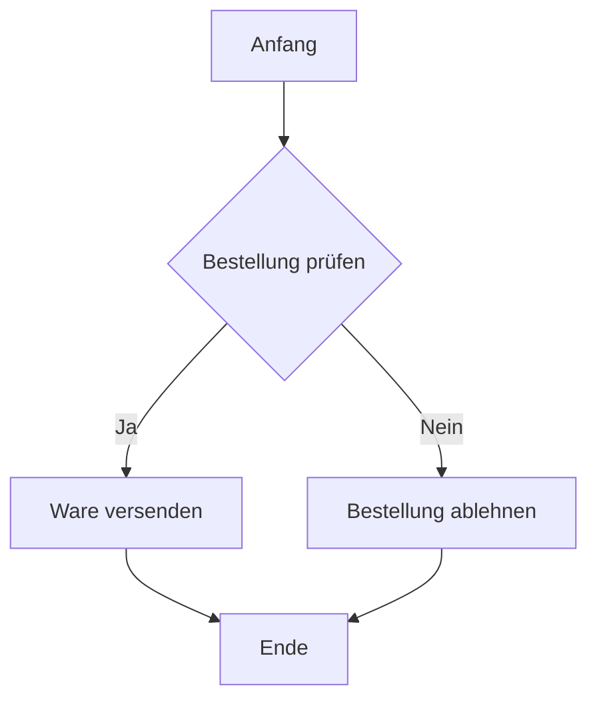

Das UML-Aktivitätsdiagramm ist ein Diagrammtyp der Unified Modeling Language ([UML](/open-fidup/lerninhalte/uml)), der den Ablauf von Aktivitäten in einem System visualisiert. Es dient dazu, einen bestimmten Anwendungsfall auf einer detaillierten Ebene darzustellen und den Fluss der Aktivitäten durch ein System zu zeigen. Auf diese Weise unterstützt es die Modellierung und das Verständnis komplexer Prozesse.

## Zweck
Das UML-Aktivitätsdiagramm hilft dabei, den Fluss von Aktivitäten in einem System zu visualisieren. Es ermöglicht die Darstellung eines bestimmten Anwendungsfalls auf einer detaillierten Ebene und zeigt den Ablauf der Aktivitäten durch das System.

## Elemente
Das UML-Aktivitätsdiagramm umfasst verschiedene Elemente, die den Ablauf und die Struktur von Aktivitäten beschreiben. Die folgenden Elemente sind zentral:

| Element | Beschreibung |
|---------|--------------|
| Anfangsknoten | Stellt den Anfangszustand der Aktivität dar. |
| Aktivität | Darstellung einer Aktivität des Prozesses. |
| Aktion | Ausführbarer Teilbereich einer Aktivität. |
| Kontrollfluss | Verbindet eine Aktion mit einer anderen. |
| Objektfluss | Weg von Objekten, die sich durch die Aktivität bewegen. |
| Aktivität-Endknoten | Ende aller Kontrollflüsse. |
| Fluss-Endknoten | Ende eines einzelnen Kontrollflusses. |
| Entscheidungs-Knotenpunkt / Knoten verschmelzen | Bedingter Verzweigungspunkt mit einem Eingang und mehreren Ausgängen; Zusammenfließen von Strömen mit mehreren Eingängen und einem Ausgang. |
| Gabel | Fluss, der sich in zwei oder mehr parallele Ströme verzweigt. |
| Zusammenführen | Fluss, der zwei oder mehr parallele Ströme zusammenführt. |
| Senden von Signalen | Sendet ein Signal an eine annehmende Aktivität. |
| Signal-Empfang | Empfängt ein Signal von einer sendenden Aktivität. |
| Anmerkung/Kommentar | Zusätzliche Erläuterungen oder Kommentare. |
| Swimlanes | Partitionen, die Aktionen anhand ihrer Akteure trennen. Vorteile: Machen lineare Prozesse leichter lesbar, jedoch nicht mehr als fünf Swimlanes empfohlen. |

## Beispiel
Ein Beispiel für ein UML-Aktivitätsdiagramm zeigt den Ablauf eines einfachen Prozesses, wie die Bearbeitung einer Bestellung. Es beginnt mit einem Anfangsknoten, führt durch Aktionen wie "Bestellung prüfen" und "Ware versenden" und endet mit einem Endknoten. Entscheidungspunkte können Verzweigungen darstellen, etwa bei der Prüfung der Verfügbarkeit.

## Quellen
Siriwardhana, S. (2022). Aktivitätsdiagramm UML: Symbol, Beispiele & Erstellung [Leitfaden]. Creately Blog. Abgerufen von https://creately.com/blog/de/diagramme/aktivitatsdiagramm-uml