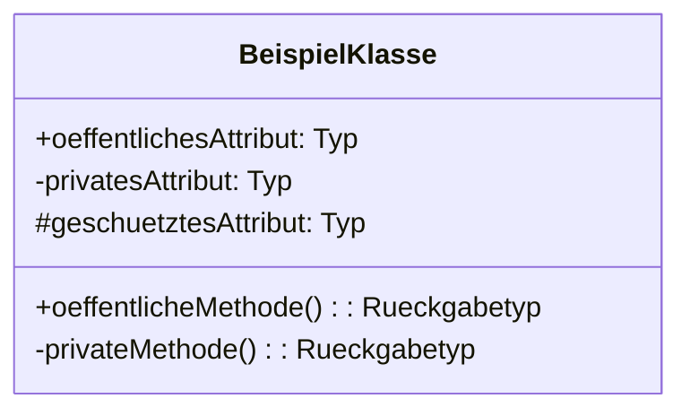
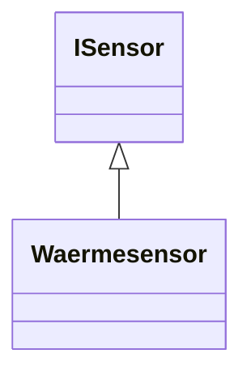
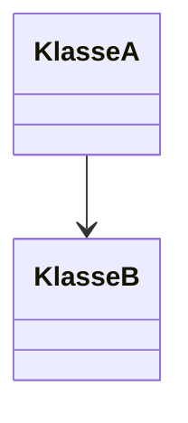
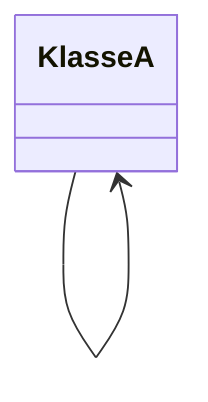
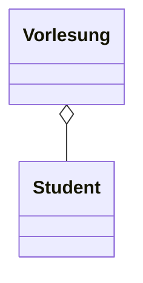
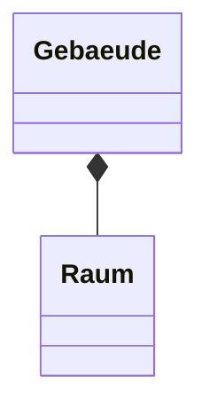

Das UML-Klassendiagramm ist ein Diagrammtyp der Unified Modeling Language ([UML](/open-fidup/lerninhalte/uml)), der zur Veranschaulichung von Systemen der objektorientierten Programmierung dient. Es zeigt Zustände von Systemen und beschreibt Interaktionen zwischen Systemelementen.

## Elemente

Das UML-Klassendiagramm besteht aus verschiedenen Elementen, die Klassen und ihre Beziehungen darstellen. Klassen werden mit ihren Attributen und Methoden abgebildet, wobei Sichtbarkeiten durch Symbole gekennzeichnet werden: **+** für öffentlich (public), **-** für privat (private) und **#** für geschützt (protected). Schlüsselwörter sind optional.

Die Generalisierung stellt eine Spezialisierung dar, bei der eine Unterklasse Eigenschaften von einer Oberklasse erbt. Zum Beispiel spezialisiert sich ein Wärmesensor von einem ISensor.

Assoziationen beschreiben Beziehungen zwischen Klassen. Eine binäre Assoziation verbindet zwei Klassen direkt.

Eine reflexive Assoziation bezieht sich eine Klasse auf sich selbst.

Die Aggregation ist eine Teil-Ganzes-Beziehung, bei der das Teil selbständig existiert. Sie wird durch einen leeren Pfeil dargestellt. Zum Beispiel existiert ein Student unabhängig von einer Vorlesung.

Die Komposition ist ebenfalls eine Teil-Ganzes-Beziehung, bei der das Teil unselbständig ist. Sie wird durch einen ausgefüllten Pfeil dargestellt. Zum Beispiel existiert ein Raum nicht ohne ein Gebäude.

## Quellen

> Redaktion, I. (2019). Klassendiagramme mit UML erstellen. IONOS Digital Guide. Retrieved from https://www.ionos.at/digitalguide/websites/web-entwicklung/klassendiagramme-mit-uml-erstellen  
> Macke, S. (2023, August 18). UML-Klassendiagramm für AP1 der IT-Berufe. Youtube. Retrieved from https://www.youtube.com/watch?v=F3RDwz-uoX8  
> Autoren der Wikimedia-Projekte. (2003, December 20). Klassendiagramm – Wikipedia. Retrieved from https://de.wikipedia.org/w/index.php?title=Klassendiagramm&oldid=247765241