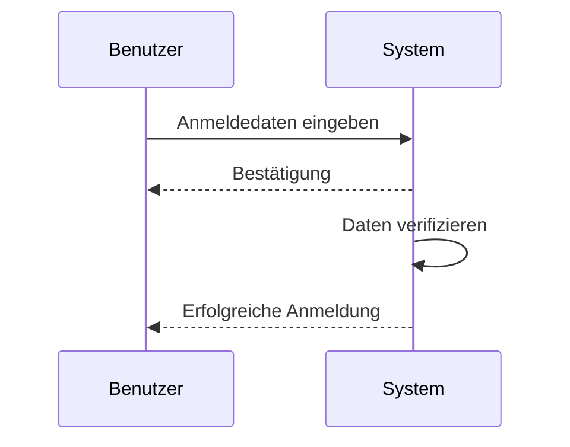
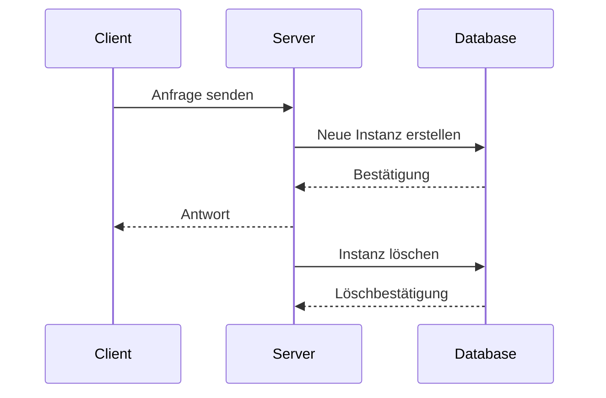

Das UML-Sequenzdiagramm ist ein Diagrammtyp der Unified Modeling Language (UML), der den zeitlichen Ablauf von Ereignissen und den Austausch von Nachrichten zwischen Objekten in einem System darstellt. Es konzentriert sich auf die genaue Reihenfolge der Interaktionen, wobei spezifische Zeitpunkte weniger relevant sind. Lebenslinien repräsentieren den Zeitverlauf einzelner Prozesse oder Objekte. Eine Gruppe von Objekten wird mit ihren Lebenslinien abgebildet, zusammen mit den Nachrichten, die sie während der Interaktion austauschen.

## Überblick
Das Sequenzdiagramm stellt Ereignisse chronologisch dar und beschreibt, wie Objekte Nachrichten in einer bestimmten Reihenfolge austauschen. Die genaue Reihenfolge ist wichtiger als spezifische Zeitpunkte. Lebenslinien repräsentieren den Zeitverlauf eines Prozesses.

## Elemente
Das Sequenzdiagramm verwendet verschiedene Symbole und Elemente, die im Folgenden beschrieben werden. Diese Elemente helfen dabei, die Interaktionen zwischen Objekten zu visualisieren.

| Element | Beschreibung |
|---------|--------------|
| Objekt | Ein Objekt in UML, dargestellt ohne Klassenattribute. |
| Aktivitätsbalken | Der Zeitraum, den ein Objekt benötigt, um eine Aufgabe abzuschließen. |
| Akteur | Entitäten, die mit dem System interagieren oder systemintern sind. |
| Lebenslinien | Aufeinanderfolgende Ereignisse, die einem Objekt zugeordnet sind. |
| Synchrone Nachrichten | Nachrichten, bei denen der Absender auf eine Antwort warten muss. |
| Asynchrone Nachrichten | Nachrichten, bei denen keine Antwort erforderlich ist. |
| (Asynchrone) Antwortnachrichten | Antworten vom Empfänger. |
| Asynchrone Nachrichtenerstellung | Erstellung eines neuen Objekts. |
| Löschnachrichten | Zerstörung eines Objekts. |

## Beispiel
Ein einfaches Beispiel für ein Sequenzdiagramm zeigt die Interaktion zwischen einem Benutzer und einem System zur Anmeldung.

Ein weiteres Beispiel illustriert eine komplexere Interaktion mit mehreren Objekten, einschließlich der Erstellung und Löschung von Objekten.

## Quellen

> Redaktion, I. (2018). Sequenzdiagramme: Den Nachrichtenaustausch in einem System mit UML darstellen. IONOS Digital Guide. Retrieved from https://www.ionos.de/digitalguide/websites/web-entwicklung/sequenzdiagramme-mit-uml-erstellen  
> Rational Application Developer for WebSphere Software 9.7.0. (2021, March 03). Retrieved from https://www.ibm.com/docs/de/radfws/9.7?topic=diagrams-sequence  
> UML Sequenzdiagramm. (2024, September 13). Retrieved from https://www.lucidchart.com/pages/de/uml-sequenzdiagramme