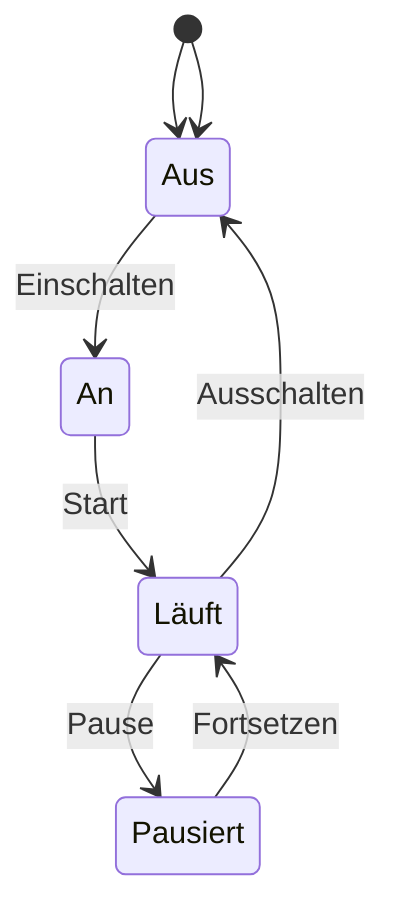
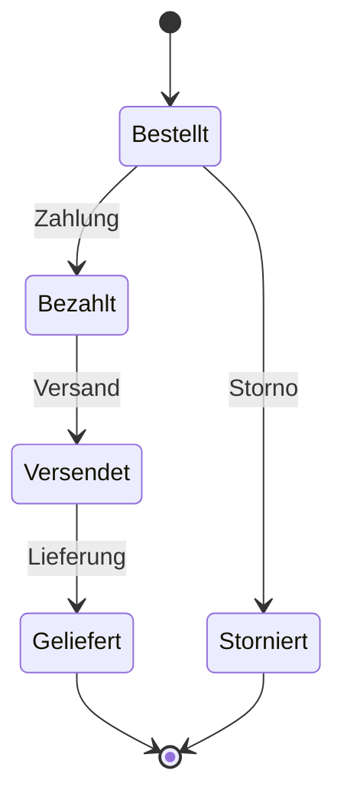
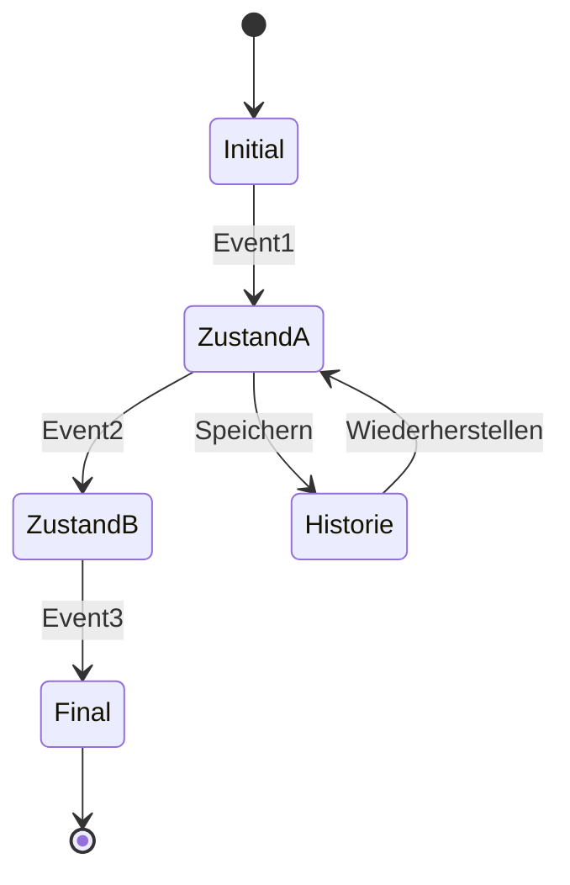

Das UML-Zustandsdiagramm dient der Visualisierung von Zuständen eines endlichen Automaten sowie des Lebenszyklus einzelner Objekte. Es umfasst einen Anfangszustand, einen Endzustand und mindestens einen Zwischenzustand, die durch Transitionen verbunden sind. Ereignisse wie entry, exit und do steuern die Zustandswechsel.

## Diagrammstruktur
Jedes UML-Zustandsdiagramm weist folgende grundlegende Elemente auf:
- **Anfangszustand**: Der Ausgangspunkt des Diagramms.
- **Endzustand**: Der Abschlusspunkt des Diagramms.
- Mindestens einen **Zwischenzustand**: Zustände, die zwischen Anfang und Ende liegen.

## Zustände
Zustände werden als Rechtecke dargestellt. Neben den grundlegenden Zuständen existieren Pseudozustände, die spezielle Funktionen erfüllen:
- **Startzustand**: Hat keine eingehende Transition und genau eine ausgehende Transition.
- **Endzustand**: Hat keine ausgehende Transition und markiert das Ende der Verhaltensabfolge.
- **Gabelung**: Ermöglicht die Aufspaltung in parallele Zustände.
- **Synchronisation**: Vereinigt mehrere parallele Zustände.
- **Kreuzung**: Dient als Knotenpunkt für mehrere Transitionen.
- **Entscheidung**: Ermöglicht alternative Transitionen basierend auf einer vorherigen Entscheidung.
- **Eintrittspunkt**: Fasst gleichartige Transitionen in einen zusammengesetzten Zustand zusammen.
- **Austrittspunkt**: Fasst gleichartige Transitionen aus einem zusammengesetzten Zustand zusammen.
- **Flache Historie**: Speichert den letzten aktiven Unterzustand eines zusammengesetzten Zustands.
- **Tiefe Historie**: Speichert den letzten aktiven Unterzustand aller Hierarchie-Ebenen eines zusammengesetzten Zustands.

## Ereignisse
Ereignisse beschreiben Bedingungen für Zustandswechsel:
- **entry**: Wird automatisch beim Eintritt in einen Zustand ausgelöst.
- **exit**: Wird beim Verlassen eines Zustands ausgelöst.
- **do**: Wird wiederholt ausgelöst, solange der Zustand nicht wechselt.

## Transitionen
Transitionen sind Zustandsübergänge, die durch Ereignisse ausgelöst werden. Sie unterteilen sich in:
- **Innere Transitionen**: Sind nicht unbedingt Bestandteil des Diagramms.
- **Äußere Transitionen**: Sind obligatorisch und führen zu einem Zustandswechsel.

## Elemente
```mermaid
stateDiagram-v2
    [*] --> Startzustand
    Startzustand --> Zwischenzustand1 : Ereignis
    Zwischenzustand1 --> Entscheidung
    Entscheidung --> Zwischenzustand2 : Bedingung wahr
    Entscheidung --> Zwischenzustand3 : Bedingung falsch
    Zwischenzustand2 --> Gabelung
    Zwischenzustand3 --> Gabelung
    Gabelung --> ParallelerZustand1
    Gabelung --> ParallelerZustand2
    ParallelerZustand1 --> Synchronisation
    ParallelerZustand2 --> Synchronisation
    Synchronisation --> Endzustand
    Endzustand --> [*]
    note right of Zwischenzustand1 : entry: Aktion beim Eintritt\nexit: Aktion beim Verlassen\ndo: Kontinuierliche Aktion
```

## Beispiele






## Quellen
Redaktion, I. (2020). UML-Zustandsdiagramme: Folgen von Objektzuständen sichtbar machen. IONOS Digital Guide. Abgerufen von https://www.ionos.de/digitalguide/websites/web-entwicklung/uml-zustandsdiagramm