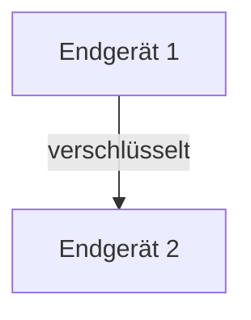
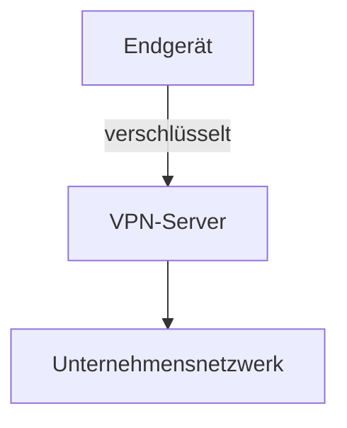
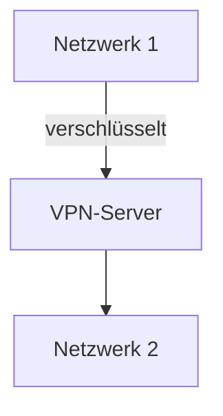

Virtuelle private Netzwerke (VPNs) ermöglichen sichere und zuverlässige Verbindungen über unsichere Netzwerke wie das Internet. Sie schützen Internetaktivitäten und verschleiern die Identität durch Tunneling und Verschlüsselung. Verschiedene Modelle wie End-to-End, End-to-Site und Site-to-Site decken unterschiedliche Anwendungsfälle ab und bieten Vorteile wie Datenschutz, bergen jedoch Nachteile wie mögliche Geschwindigkeitsverluste.

## Funktionsweise
VPNs erstellen einen verschlüsselten Tunnel zwischen dem Endgerät und dem VPN-Server, um Daten vor Dritten zu schützen. Die Verschlüsselung erfolgt mit Protokollen wie dem Advanced Encryption Standard (AES), um die Vertraulichkeit zu gewährleisten. Die Authentifizierung erfordert oft Benutzernamen und Passwort oder Zertifikate für den Zugang zum VPN.

## Protokolle
Verschiedene Protokolle unterstützen die VPN-Funktionalität mit unterschiedlichen Sicherheits- und Leistungsmerkmalen:

- **PPTP (Point-to-Point Tunneling Protocol)**: Einfach zu konfigurieren, aber weniger sicher.
- **L2TP/IPsec (Layer 2 Tunneling Protocol)**: Bietet bessere Sicherheit durch Kombination mit IPsec, jedoch langsamer.
- **OpenVPN**: Open-Source-Protokoll, sehr sicher und flexibel, unterstützt verschiedene Verschlüsselungsmethoden.
- **IKEv2/IPsec (Internet Key Exchange Version 2)**: Bietet hohe Sicherheit und Stabilität, besonders bei mobilen Geräten.
- **WireGuard**: Modernes, einfaches und schnelles VPN-Protokoll, das eine hohe Sicherheit bei geringem Overhead bietet. Es verwendet kryptografische Methoden, die als sicher gelten und ist einfach zu implementieren.

## Modelle
VPN-Modelle variieren je nach Verbindungsart und Anwendungsbereich.

### End-to-End VPN
Dieses Modell verbindet zwei Endgeräte direkt miteinander, sodass die Kommunikation zwischen diesen Geräten verschlüsselt ist. Es eignet sich ideal für private Kommunikation.

### End-to-Site VPN
Dieses Modell verbindet ein einzelnes Endgerät, wie einen Laptop, mit einem Netzwerk, beispielsweise einem Unternehmensnetzwerk. Es ermöglicht dem Benutzer den Zugriff auf Ressourcen im Netzwerk, als wäre er vor Ort.

### Site-to-Site VPN
Dieses Modell verbindet zwei oder mehr Netzwerke miteinander, etwa Büros eines Unternehmens an verschiedenen Standorten. Es ermöglicht eine sichere Kommunikation zwischen den Netzwerken.

## Vorteile
VPNs bieten mehrere Vorteile für Datenschutz und Sicherheit:

- **Datenschutz**: Sie gewährleisten Anonymität im Internet durch Verschleierung der IP-Adresse.
- **Sicherheit**: Schutz vor Man-in-the-Middle-Angriffen und Abhörmaßnahmen.
- **Zugriff auf gesperrte Inhalte**: Umgehung von Geoblocking und Zensur, etwa für Streaming-Dienste oder Webseiten in bestimmten Ländern.

## Nachteile
Trotz ihrer Vorteile haben VPNs auch Nachteile:

- **Geschwindigkeit**: Sie können die Internetgeschwindigkeit verringern, da Daten durch den VPN-Server geleitet werden.
- **Kosten**: Viele zuverlässige VPN-Dienste sind kostenpflichtig.
- **Vertrauenswürdigkeit des Anbieters**: Nutzer müssen einen seriösen Anbieter wählen, da dieser möglicherweise Protokolle der Internetaktivitäten speichert.

## Anwendungsgebiete
VPNs finden in verschiedenen Bereichen Anwendung:

- **Fernzugriff**: Mitarbeiter greifen sicher auf Unternehmensressourcen zu, auch außerhalb des Büros.
- **Öffentliche WLAN-Netzwerke**: Schutz der Datenübertragung in unsicheren Netzwerken, etwa in Cafés oder Flughäfen.
- **Umgehung von Zensur**: Zugang zu Informationen und Plattformen, die in bestimmten Ländern eingeschränkt sind.

## Rechtliche Aspekte
Bei der Nutzung von VPNs sind rechtliche Gesichtspunkte zu beachten:

- **Nutzungsbedingungen**: Einige Dienste verbieten die Nutzung von VPNs, was zu einem Verstoß gegen die Nutzungsbedingungen führen kann.
- **Datenschutzgesetze**: Nutzer sollten sich über die Datenschutzbestimmungen des VPN-Anbieters informieren, insbesondere hinsichtlich der Speicherung von Nutzerdaten.

## Quellen
> AI Chat. (2024, September 20). Retrieved from https://duckduckgo.com/?q=DuckDuckGo+AI+Chat&ia=chat&duckai=1