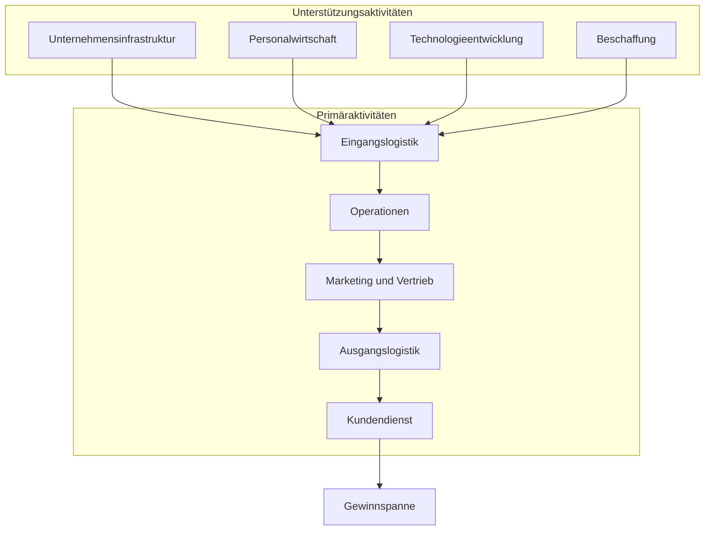

Die Wertschöpfungskette veranschaulicht die einzelnen Schritte, die ein Produkt durchlaufen muss, um mit Mehrwert verkauft zu werden. Sie basiert auf dem Modell von Michael E. Porter und unterteilt sich in Primäraktivitäten, die direkt mit der Erstellung des Produkts oder der Dienstleistung zusammenhängen, sowie Unterstützungsaktivitäten, die als Voraussetzung für die primären Aktivitäten dienen. Die Gewinnspanne ergibt sich aus dem Vergleich von Umsatz und angefallenen Kosten.

## Primäraktivitäten

Primäraktivitäten umfassen alle Tätigkeiten, die direkt mit der Erstellung des Produkts oder der Dienstleistung zusammenhängen. Sie entsprechen den [Hauptprozessen](/open-fidup/lerninhalte/haupt--und-teilprozesse) und gliedern sich wie folgt:

- Eingangslogistik: Empfang, Lagerung und Verteilung der Eingangsstoffe.
- Operationen: Umwandlung der Eingangsstoffe in das Endprodukt.
- Marketing und Vertrieb: Werbung, Verkauf und Vertriebskanäle.
- Ausgangslogistik: Lagerung und Verteilung des fertigen Produkts an Kunden.
- Kundendienst: Nachverkaufsunterstützung und Service.

## Unterstützungsaktivitäten

Unterstützungsaktivitäten sind alle Tätigkeiten, die als Voraussetzung zur Ausführung der primären Aktivitäten benötigt werden. Sie entsprechen den [Teilprozessen](/open-fidup/lerninhalte/haupt--und-teilprozesse) und umfassen:

- Unternehmensinfrastruktur: Verwaltung, Planung und Finanzierung.
- Personalwirtschaft: Rekrutierung, Schulung und Management der Mitarbeiter.
- Technologieentwicklung: Forschung, Entwicklung und Verbesserung von Technologien.
- Beschaffung: Einkauf von Materialien und Dienstleistungen.

## Gewinnspanne

Die Gewinnspanne ergibt sich aus der Gegenüberstellung des Umsatzes mit den angefallenen Kosten. Sie repräsentiert den Mehrwert, der durch die Wertschöpfungskette generiert wird.

## Anwendung der Wertschöpfungskettenanalyse

Die Analyse der Wertschöpfungskette dient der Identifikation von Verbesserungspotenzialen und der Optimierung von Prozessen. Sie findet in verschiedenen Bereichen Anwendung:

1. **Identifikation von Verbesserungspotenzialen**: Durch den Vergleich der eigenen Wertschöpfungskette mit der von Wettbewerbern können Unternehmen Bereiche identifizieren, in denen sie sich verbessern können.
2. **Kostenoptimierung**: Die Analyse hilft, Aktivitäten zu identifizieren, die hohe Kosten verursachen, aber wenig zum Kundennutzen beitragen.
3. **Strategieentwicklung**: Basierend auf den Erkenntnissen der Analyse können Unternehmen ihre Kernkompetenzen erkennen und darauf aufbauend Wettbewerbsstrategien entwickeln.
4. **Branchenspezifische Anwendungen**:
   - In der Industrie: Zur Verbesserung von Produktionsprozessen und Maximierung des Produktwerts.
   - Im Dienstleistungssektor: Zur Optimierung von Kundenservice-Prozessen und Evaluierung von Marketingstrategien.
   - In der Landwirtschaft: Zur Effizienzsteigerung in der Nahrungsmittelproduktion, von der Aussaat bis zur Vermarktung.
5. **Prozessoptimierung**: Die Analyse hilft bei der Gestaltung unternehmensinterner Prozesse und der Identifikation von Optimierungspotenzialen.
6. **Wettbewerbsanalyse**: Durch die Visualisierung in einer Matrix können Unternehmen ihre Position im Vergleich zu Wettbewerbern einschätzen und Prioritäten für Verbesserungen setzen.